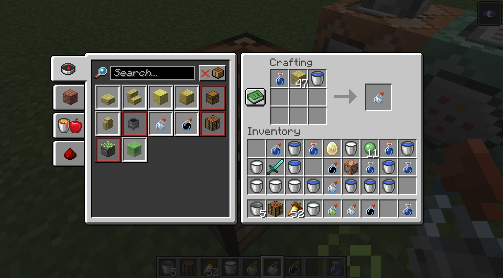
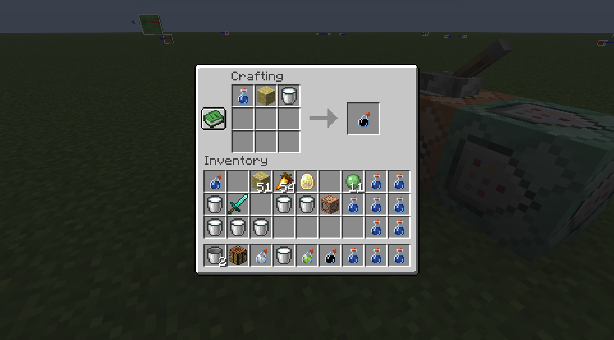

# brimstone_invis

Potions to permanently toggle invisible/visible sulphur cubes.
Crafting recipe: 

- Potion of invisiblity - `minecraft:potion, minecraft:sulfur, minecraft:water_bucket`
- Potion of cleansing - `minecraft:potion, minecraft:sulfur, minecraft:milk_bucket`

Potions apply NV and blindness (each amplified by 64) for 2 seconds. Sulphur cubes toggle invisiblity, all other mobs have standard effects.

# screenshots

